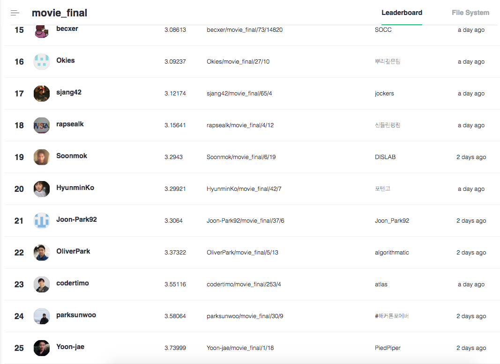

## Mission
* 네이버 영화 평점 예측

&nbsp;주어진 미션은 기존 영화 평과 평점을 학습해서 주어진 영화 평에 가장 알맞는 평점이 몇 점인지 예측하는 모델을 개발하는 것이었습니다<br>
데이터의 구조는 영화 평과 평점이 따로 주어졌습니다<br>

<table class="tbl_data_structure">
  <tr>
    <th style="text-align:left;width:85%">영화 평</th>
    <th style="text-align:center;width:15%">평점</th>
  </tr>
  <tr>
    <td style="text-align:center">영화를 이루는 모든 요소가 완전하다</td>
    <td>
      10
    </td>
  </tr>
  <tr>
      <td style="text-align:center">너무 흥미롭고 단 한순간도 지루할틈이 없었다</td>
      <td>
        9
      </td>
    </tr>
  <tr>
      <td style="text-align:center">이해는 하나 공감은 할 수 없는 영화</td>
      <td>
        7
      </td>
    </tr>
  <tr>
      <td style="text-align:center">진짜 이 영화 무슨 내용인지 모르겠네</td>
      <td>
        2
      </td>
    </tr>
</table>

최초로 기본적인 전처리와 영화리뷰 예측을 위한  Regression 모델을 포함한 [baseline](https://github.com/naver/ai-hackathon-2018/blob/master/missions/examples/movie-review/example)이 제공되었습니다 

## Model
* CNN for Sentence Classification
    - N*K representation of sentence
    - Convolutional layer with multiple filter widths and feature map
    - Max over time pooling
    - Fully Connected layer with dropout and softmax output
    
## Hyperparameter search
* Effect of filter region size
    - (7,7,7,7)  
    - (10,10,10,10) 
    - (15,15,15,15) 
    - (30,30,30,30)
    - (7,8,9,10) : score 4.574 (selected) 
    
* number of feature maps
    - 200
    - 400 : score 4.47 (selected)
    - 600

* activation function
    - relu 
    - tanh : (selected)
    - iden

* regularization
    - 0.5
    - 0.25 : (selected)
    - 0.0
    
## Usage
### on NSML

````bash
$ cd movie-review/model
$ nsml run -d movie_final -e main.py -a "--embedding 100 --kernel_num 400 --kernel_sizes '7,8,9,10' --dropout 0.25 --lr 0.01"
````

## Final score
Score : <strong>3.58064</strong> / 결선 참가팀 중 <strong>24등</strong><br><br>


## Reference
- paper : [Convolutional Neural Networks for Sentence Classification](https://arxiv.org/abs/1408.5882)<br>
- paper : [A Sensitivity Analysis of (and Practitioners' Guide to) Convolutional Neural Networks for Sentence Classification](https://arxiv.org/abs/1510.03820)<br>
- blog : [합성곱 신경망(CNN) 딥러닝을 이용한 한국어 문장 분류](http://docs.likejazz.com/cnn-text-classification-tf)<br>
- blog : [CNN으로 문장 분류하기](https://ratsgo.github.io/natural%20language%20processing/2017/03/19/CNN)


